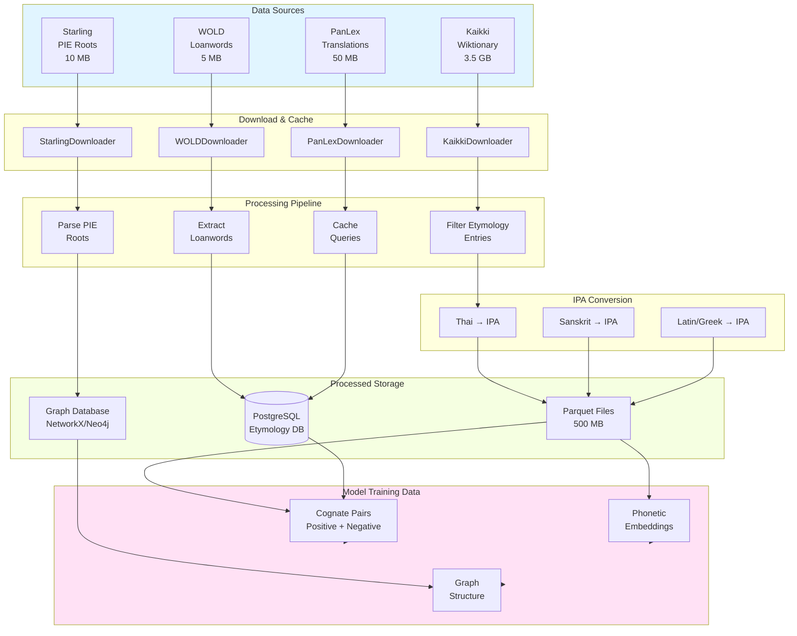
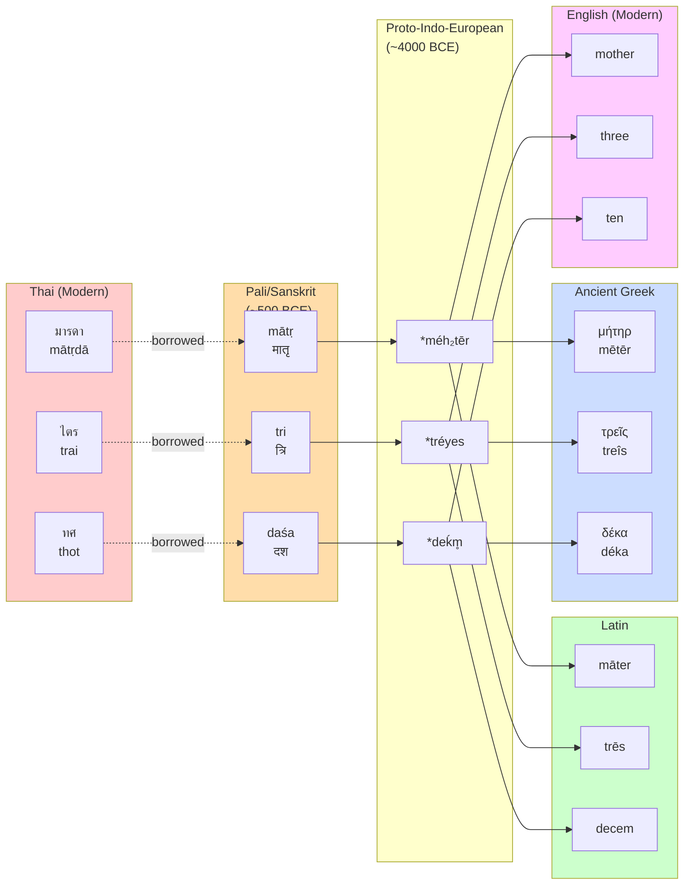

# Data Pipeline Architecture



---

# Etymology Chain Structure



---

# Model Architecture

```mermaid
graph TB
    subgraph Input["Input Layer"]
        W1[Word 1:<br/>มารดา]
        W2[Word 2:<br/>mother]
    end
    
    subgraph Phonetic["Phonetic Conversion"]
        IPA1[IPA:<br/>mɑːdɑː]
        IPA2[IPA:<br/>mʌðər]
    end
    
    subgraph Embedding["Phonetic Embedding<br/>(Transformer)"]
        E1[Encoder 1<br/>6 layers<br/>512-dim]
        E2[Encoder 2<br/>SHARED WEIGHTS<br/>512-dim]
    end
    
    subgraph Vector["Vector Space"]
        V1[φ₁ ∈ ℝ⁵¹²]
        V2[φ₂ ∈ ℝ⁵¹²]
    end
    
    subgraph Similarity["Similarity Scoring"]
        COS[Cosine<br/>Similarity]
        DIST[Distance:<br/>d = 1 - cos(φ₁, φ₂)]
    end
    
    subgraph Output["Cognate Prediction"]
        PROB[P(cognate)]
        CONF[Confidence<br/>Score]
    end
    
    W1 --> IPA1 --> E1 --> V1
    W2 --> IPA2 --> E2 --> V2
    
    V1 --> COS
    V2 --> COS
    COS --> DIST --> PROB --> CONF
    
    subgraph GNN["Graph Neural Network<br/>(Etymology Tree)"]
        N1[Node:<br/>มารดา]
        N2[Node:<br/>mātṛ]
        N3[Node:<br/>*méh₂tēr]
        N4[Node:<br/>mother]
        
        N1 -.edge.-> N2
        N2 -.edge.-> N3
        N3 -.edge.-> N4
    end
    
    CONF -.predict edges.-> GNN
    
    style Input fill:#e1f5ff
    style Embedding fill:#ffe1f5
    style GNN fill:#f5ffe1
    style Output fill:#ffffcc
```
